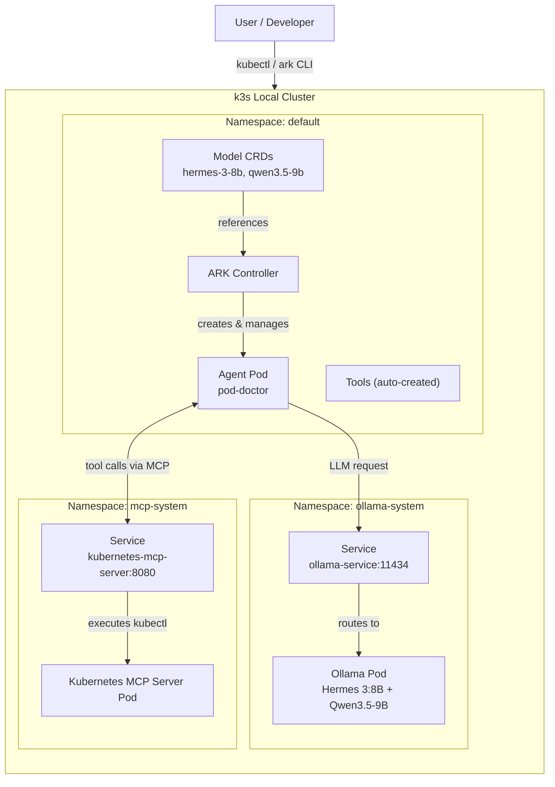

# Architecture

## Components

- **k3s** – lightweight Kubernetes cluster, runs on local machine (Traefik disabled).
- **Ollama** – serves two LLMs (Hermes 3:8B and Qwen3.5‑9B) via a single Deployment, PersistentVolumeClaim, and Service. Both models are pulled by default. Ollama exposes an OpenAI‑compatible API at `/v1`.
- **ARK** – agentic runtime by McKinsey, provides CRDs for agents, models, queries, and MCP servers. Installed in the `default` namespace.
- **Kubernetes MCP Server** – dedicated server in the `mcp-system` namespace. Exposes 19 Kubernetes tools (pods-list, pods-get, pods-log, events-list, pods-top, etc.). Registered as an `MCPServer` resource in ARK, which automatically creates corresponding `Tool` CRDs in the `default` namespace.
- **`pod-doctor` agent** – uses the `qwen3.5-9b` model by default (more accurate for tool calling). It calls the MCP tools to inspect the cluster (describe pods, get logs, show events, etc.). Its RBAC is minimal because all permissions are delegated to the MCP server.

All ARK resources (agents, models, tools) are in the `default` namespace for simplicity. The MCP server runs in `mcp-system` for isolation. This architecture allows agents to interact with the cluster without needing `kubectl` inside their container.
