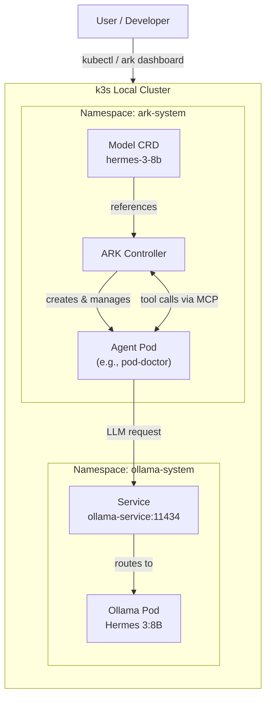

# Architecture

```mermaid
flowchart TD
    A[User / Developer] -->|kubectl / ark dashboard| B[k3s Cluster]

    subgraph B [k3s Local Cluster]
        direction TB
        C[Ollama Namespace]
        D[ARK Namespace]
    end

    subgraph C [Namespace: ollama-system]
        C1[Ollama Pod<br>Hermes 3:8B]
        C2[Service<br>ollama-service:11434]
    end

    subgraph D [Namespace: ark-system]
        D1[ARK Controller]
        D2["Agent Pod<br>(e.g., pod-doctor)"]
        D3[Model CRD<br>hermes-3-8b]
    end

    D3 -->|references| D1
    D1 -->|creates & manages| D2
    D2 <-->|tool calls via MCP| D1
    D2 -->|LLM request| C2
    C2 -->|routes to| C1
```

Components:
- k3s (local, no Traefik)
- Ollama Operator + Hermes 3:8B model
- ARK framework
- Custom agent (e.g., `pod-doctor` agent with RBAC)
